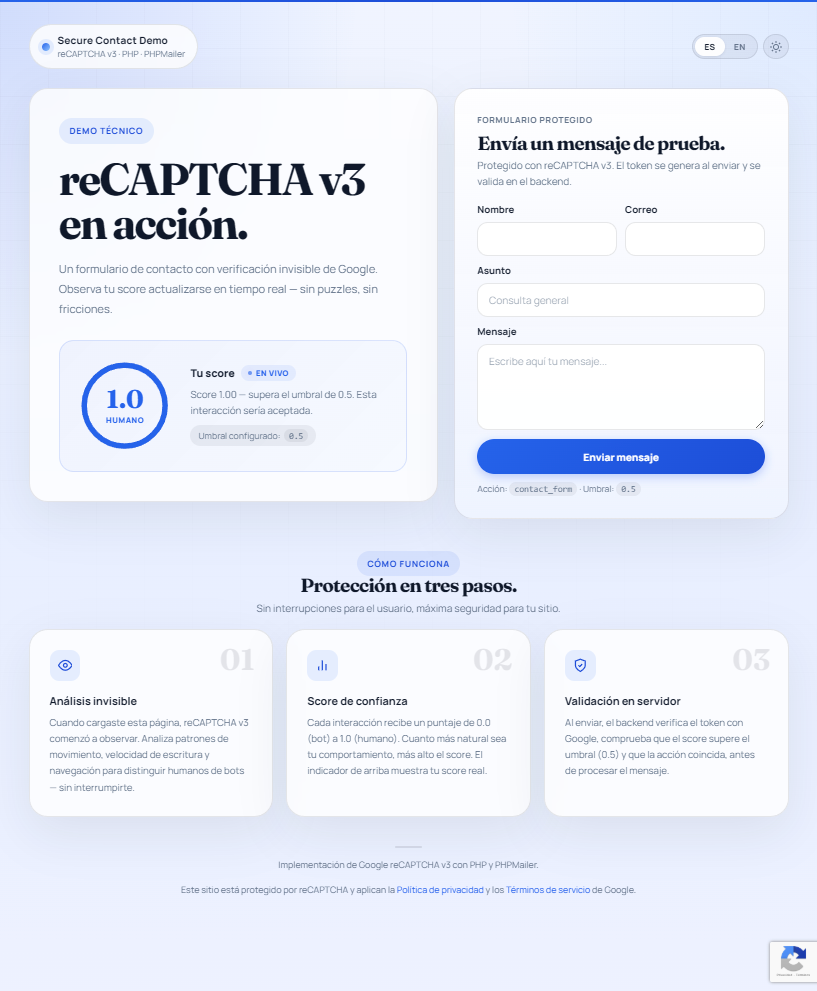
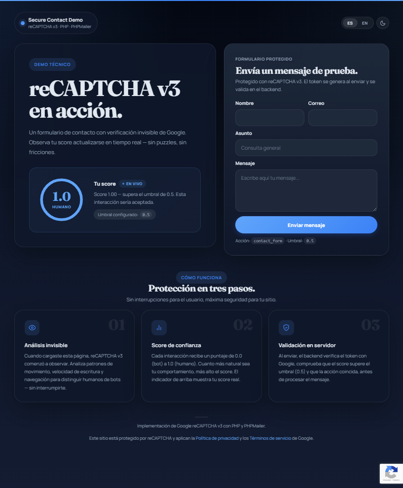
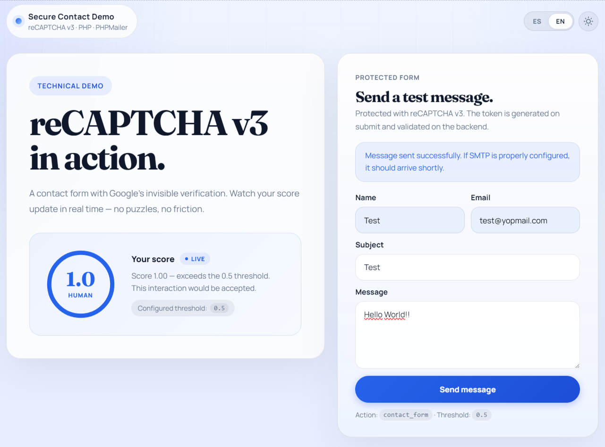

<a id="readme-top"></a>

<p align="right">
  <a href="./README.es.md">Leer en español</a>
</p>

[![PHP][php-shield]][php-url]
[![reCAPTCHA][recaptcha-shield]][recaptcha-url]
[![PHPMailer][phpmailer-shield]][phpmailer-url]
[![Status][status-shield]][status-url]

<br />
<div align="center">
  <h1>reCAPTCHA v3 — Secure Contact Form</h1>
  <p>
    Self-contained PHP contact form protected with Google reCAPTCHA v3, live score widget, and SMTP delivery via PHPMailer.
    <br />
    <strong>Author:</strong> JI Gutierrez · <strong>Focus:</strong> technical proposal / portfolio
    <br />
    <a href="#screenshots"><strong>See screenshots</strong></a>
    ·
    <a href="#getting-started">Run locally</a>
    ·
    <a href="#security">Security</a>
  </p>
</div>

---

<details>
  <summary>Table of contents</summary>
  <ol>
    <li><a href="#about">About</a></li>
    <li><a href="#screenshots">Screenshots</a></li>
    <li><a href="#features">Features</a></li>
    <li><a href="#security">Security</a></li>
    <li><a href="#prerequisites">Prerequisites</a></li>
    <li><a href="#getting-started">Getting started</a></li>
    <li><a href="#configuration">Configuration</a></li>
    <li><a href="#built-with">Built with</a></li>
    <li><a href="#project-structure">Project structure</a></li>
    <li><a href="#how-it-works">How it works</a></li>
    <li><a href="#repository-use">Repository use</a></li>
  </ol>
</details>

---

<a id="about"></a>

## About

Self-contained contact form that integrates Google reCAPTCHA v3 for frictionless bot
protection. The visitor never solves puzzles or visible captchas — reCAPTCHA silently
evaluates browsing behavior and assigns a trust score from 0.0 (bot) to 1.0 (human).

The project includes:

- Live score widget that refreshes every 25 seconds.
- Fully functional form that sends real email via SMTP (PHPMailer).
- Light / dark theme with automatic OS detection.
- Spanish / English language toggle.
- Security headers (CSP with nonce, CSRF, rate limiting).

Designed as a publishable technical demo: a single self-contained `web.php` that deploys
without build tools, heavy frameworks, or a database.

<p align="right">(<a href="#readme-top">back to top</a>)</p>

<a id="screenshots"></a>

## Screenshots

<table>
  <tr>
    <td width="50%"></td>
    <td width="50%"></td>
  </tr>
  <tr>
    <td align="center"><strong>Light theme — Spanish</strong><br />Live score, contact form, and explainer section.</td>
    <td align="center"><strong>Dark theme — Spanish</strong><br />Deep Navy palette with blue indicators.</td>
  </tr>
  <tr>
    <td width="50%"></td>
    <td width="50%"></td>
  </tr>
  <tr>
    <td align="center"><strong>Light theme — English</strong><br />Language switch without page reload.</td>
    <td align="center"><strong>Score and form</strong><br />Circular gauge with threshold and submission status.</td>
  </tr>
</table>

Screenshots live in `docs/screenshots/`.

<p align="right">(<a href="#readme-top">back to top</a>)</p>

<a id="features"></a>

## Features

1. **Invisible reCAPTCHA v3** — behavioral analysis with no puzzles.
2. **Live score** — circular gauge that polls Google every 25s with visibility control (pauses on inactive tab).
3. **Real SMTP delivery** — HTML + plain-text email via PHPMailer.
4. **Light / dark theme** — manual toggle + automatic `prefers-color-scheme` detection, persisted in `localStorage`.
5. **Bilingual (ES/EN)** — client-side i18n via `data-i18n` attributes, `navigator.language` detection.
6. **CSRF token** — single-use session token validated with `hash_equals()`.
7. **Rate limiting** — max 1 submission per 30 seconds per session.
8. **CSP with nonce** — inline scripts protected by per-request nonce, no `unsafe-inline` in `script-src`.
9. **Server-side validation** — input sanitization, output escaping, score and action verification.

<p align="right">(<a href="#readme-top">back to top</a>)</p>

<a id="security"></a>

## Security

| Layer | Implementation |
|:------|:---------------|
| Anti-bot | reCAPTCHA v3 with server-side token, score, and action verification |
| CSRF | Single-use session token, validated with `hash_equals()`, invalidated after use |
| Rate limiting | 1 submission / 30s per session |
| CSP | `script-src` with nonce + `strict-dynamic`; restricted `frame-src`, `connect-src`, `font-src` |
| Headers | `X-Frame-Options: DENY`, `X-Content-Type-Options: nosniff`, `Referrer-Policy`, `Permissions-Policy` |
| Input | Max length per field, newline sanitization, `htmlspecialchars` on output |
| Configuration | Secrets in `config.local.php` (git-ignored), environment variable support |
| PHP | `declare(strict_types=1)` in all files |

<p align="right">(<a href="#readme-top">back to top</a>)</p>

<a id="prerequisites"></a>

## Prerequisites

- [PHP](https://www.php.net/) >= 8.1 with `curl`, `mbstring`, `json` extensions
- [Composer](https://getcomposer.org/)
- [Google reCAPTCHA v3](https://www.google.com/recaptcha/admin) keys (site key + secret key)
- SMTP account for email delivery (Gmail, Mailtrap, etc.)

<p align="right">(<a href="#readme-top">back to top</a>)</p>

<a id="getting-started"></a>

## Getting started

```bash
# 1. Clone the repository
git clone <repo-url>
cd kubiprint-recaptcha

# 2. Install dependencies
composer install

# 3. Create local configuration
cp config.local.example.php config.local.php
# Edit config.local.php with your actual keys

# 4. Start the development server
php -S localhost:8000
```

Open `http://localhost:8000/web.php` in your browser.

| URL | Description |
|:----|:------------|
| `http://localhost:8000/web.php` | Form with live score |
| `http://localhost:8000/score.php` | Score JSON endpoint (POST) |
| `http://localhost:8000/contact.php` | Form handler (POST) |

<p align="right">(<a href="#readme-top">back to top</a>)</p>

<a id="configuration"></a>

## Configuration

Copy `config.local.example.php` to `config.local.php` and fill in the values:

```php
define('APP_ENV', 'development');        // 'production' for real deployment

define('RECAPTCHA_SITE_KEY', '...');     // reCAPTCHA v3 public key
define('RECAPTCHA_SECRET_KEY', '...');   // reCAPTCHA v3 secret key
define('RECAPTCHA_SCORE_THRESHOLD', 0.5); // 0.0 to 1.0

define('CONTACT_EMAIL', '...');          // Form recipient
define('SMTP_HOST', '...');              // e.g. smtp.gmail.com
define('SMTP_PORT', 587);                // 587 (STARTTLS) or 465 (SMTPS)
define('SMTP_USERNAME', '...');
define('SMTP_PASSWORD', '...');
define('SMTP_ENCRYPTION', 'tls');        // 'tls', 'ssl', or ''
```

Environment variables (`getenv()` / `$_ENV`) are also supported. `config.local.php` takes
priority over environment variables.

> **Important:** `config.local.php` is in `.gitignore`. Never commit it to the repository.

<p align="right">(<a href="#readme-top">back to top</a>)</p>

<a id="built-with"></a>

## Built with

| Tool | Version | Role |
|:-----|:--------|:-----|
| PHP | 8.1 | Backend and rendering |
| Google reCAPTCHA v3 | current | Bot protection |
| PHPMailer | 7.x | SMTP delivery |
| Composer | current | Dependency management |
| CSS Custom Properties | — | Light/dark theming |
| Vanilla JS | ES5 | i18n, score widget, theme |

No frontend frameworks. No build tools. No database.

<p align="right">(<a href="#readme-top">back to top</a>)</p>

<a id="project-structure"></a>

## Project structure

```text
kubiprint-recaptcha/
├── config.php                  # Configuration loader (env + local)
├── config.local.example.php    # Local configuration template
├── recaptcha.php               # Shared reCAPTCHA verification helper
├── web.php                     # Frontend: HTML + CSS + JS (self-contained)
├── contact.php                 # Form handler (POST)
├── score.php                   # Live score JSON endpoint (POST)
├── composer.json               # Dependency: PHPMailer
├── composer.lock               # Locked dependency versions
├── .gitignore                  # Excludes secrets, vendor/, IDE files
├── README.md                   # Documentation (English)
├── README.es.md                # Documentation (Spanish)
└── docs/
    └── screenshots/            # README images
```

<p align="right">(<a href="#readme-top">back to top</a>)</p>

<a id="how-it-works"></a>

## How it works

```text
┌─────────────┐     ┌──────────────┐     ┌─────────────────┐
│   Browser    │────>│   web.php    │     │ Google reCAPTCHA │
│              │<────│  (frontend)  │     │   siteverify     │
└──────┬───────┘     └──────────────┘     └────────┬────────┘
       │                                           │
       │  1. reCAPTCHA JS evaluates behavior        │
       │  2. grecaptcha.execute() generates token   │
       │                                           │
       ├──── POST token ────> score.php ──────────>│
       │<─── JSON {score} ── score.php <───────────│
       │                                           │
       │  3. User submits form                      │
       │                                           │
       ├──── POST form ─────> contact.php ────────>│
       │                      │ verifies token      │
       │                      │ checks score >= thr │
       │                      │ checks action       │
       │                      │ sends email (SMTP)  │
       │<──── redirect ────── contact.php           │
       │      ?status=success                       │
```

1. When `web.php` loads, reCAPTCHA v3 starts evaluating the visitor's behavior.
2. Every 25s, the frontend requests a token and sends it to `score.php`, which queries Google and returns the score.
3. On form submit, a new token is generated with action `contact_form`, validated in `contact.php` against Google, and if the score exceeds the threshold, the email is sent via PHPMailer.

<p align="right">(<a href="#readme-top">back to top</a>)</p>

<a id="repository-use"></a>

## Repository use

This repository is published as a technical demo and implementation proposal.
It does not represent a production-ready commercial product.

<p align="right">(<a href="#readme-top">back to top</a>)</p>

---

[php-shield]: https://img.shields.io/badge/PHP-8.1-777BB4?style=flat-square&logo=php&logoColor=white
[php-url]: https://www.php.net/
[recaptcha-shield]: https://img.shields.io/badge/reCAPTCHA-v3-4285F4?style=flat-square&logo=google&logoColor=white
[recaptcha-url]: https://developers.google.com/recaptcha/docs/v3
[phpmailer-shield]: https://img.shields.io/badge/PHPMailer-7.x-0078D4?style=flat-square&logo=minutemailer&logoColor=white
[phpmailer-url]: https://github.com/PHPMailer/PHPMailer
[status-shield]: https://img.shields.io/badge/status-Functional%20demo-2ea44f?style=flat-square
[status-url]: #about
